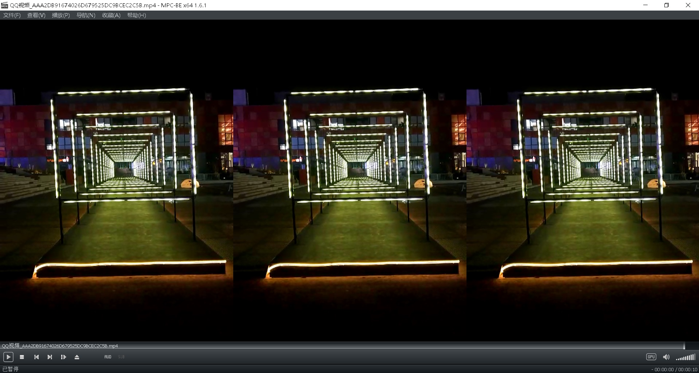
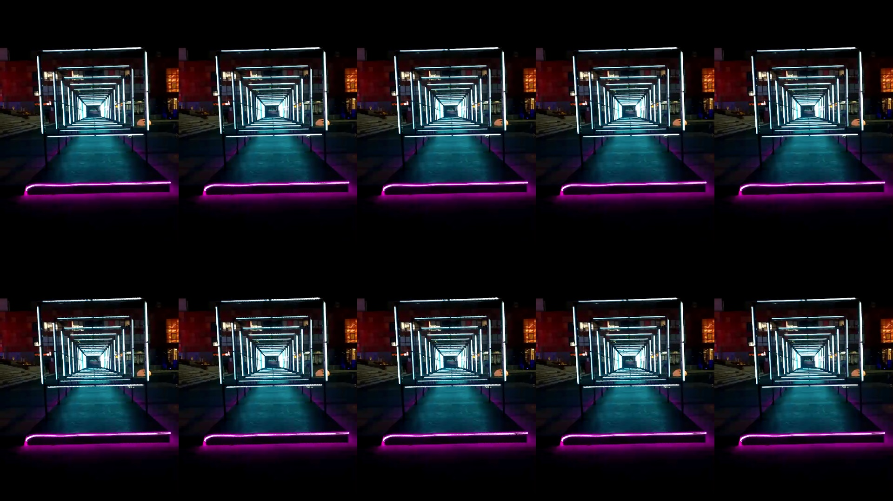
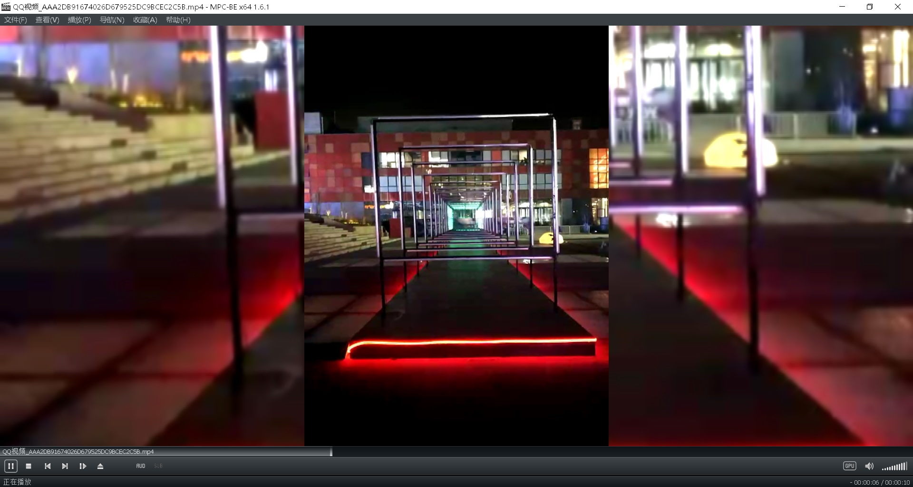
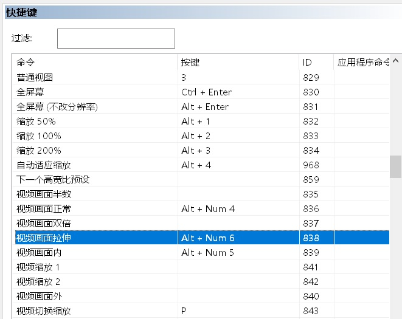
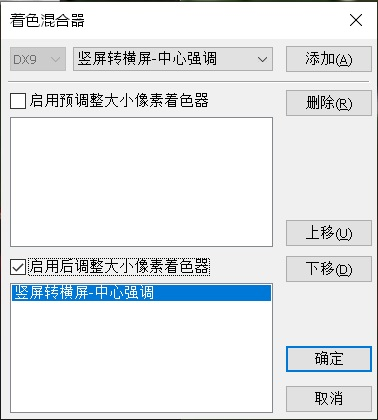

# MPC Shader

Some shaders for [Media Player Classic - BE](https://sourceforge.net/projects/mpcbe/).

为[MPC-BE](https://sourceforge.net/projects/mpcbe/)设计的若干个着色器（shader）。

## 背景

由于竖屏视频和横屏屏幕长宽比不同，在不发生形变的前提下，为了避免黑边，我总结有这几种显示效果：

1. 画幅裁切。放大画面，强制只显示和屏幕等宽的部分，超出的高度部分不显示。横向复制画面。
2. 画幅裁切并垫底，添加模糊效果，上方居中叠加一层适应高度的画面。
3. 当然还可以继续叠buff，在3的基础上，对叠加的一层画面进行放大，令视频在高度方向做一定程度的裁切，从而提高主体部分占据屏幕的尺寸。

显然，无论是后期软件还是直播软件都能够做到这样的效果，但是播放器能不能直接做到呢？更进一步，如果视频文件是使用方法2、3强制把竖屏视频转为横屏的，有没有播放器能够一键切换效果，还原为竖屏尺寸呢？

## 内容

本仓库已经基本解决了这样的问题。包含了如下几个shader：

1. 竖屏转横屏-阵列 3x1.hlsl
   
   

2. 竖屏转横屏-阵列 5x2.hlsl
   

3. 竖屏转横屏-中心强调.hlsl
   

### 使用

1. 由于MPC-BE的着色器无法变更输出的长宽尺寸，因此在应用竖屏转横屏模式的着色器之前，必须先通过快捷键或者菜单调整视频画面为拉升模式。

2. 在菜单中选择着色器-选择着色器-中添加需要的着色器效果，注意勾选“启用”，此时着色器已经生效，点击确定完成保存。
   

### 参考

中心强调使用的模糊算法来自 https://github.com/dinfinity/mpc-pixel-shaders
