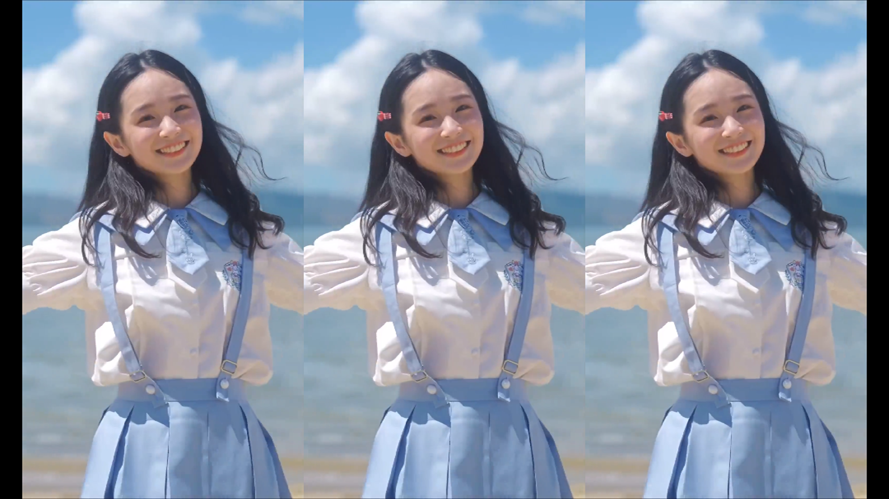
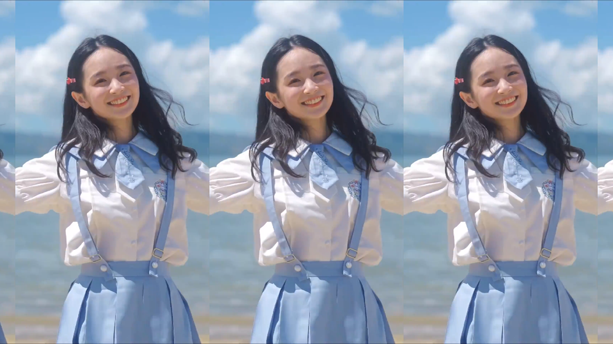

# MPC Shader

Some shaders for [Media Player Classic - BE](https://sourceforge.net/projects/mpcbe/).

为[MPC-BE](https://sourceforge.net/projects/mpcbe/)设计的若干个着色器（shader）。

## 事件一：竖屏转横屏

### 事件

由于竖屏视频和横屏屏幕长宽比不同，在不发生形变的前提下，为了避免黑边，我总结有这几种显示效果：

1. 画幅裁切。放大画面，强制只显示和屏幕等宽的部分，超出的高度部分不显示。
2. 横向复制画面。画幅裁切并垫底，添加模糊效果，上方居中叠加一层适应高度的画面。
3. 当然还可以继续叠buff，在2的基础上，对叠加的一层画面进行放大，令中心的部分在高度方向做一定程度的裁切，从而提高主体部分占据屏幕的尺寸。

显然，无论是后期软件还是直播软件都能够做到这样的效果，但是播放器能不能直接做到呢？更进一步，如果视频文件是使用方法2、3强制把竖屏视频转为横屏的，有没有播放器能够一键切换效果，还原为竖屏尺寸呢？

### 方案

本仓库已经给出了解决方案。包含了如下几个shader：

1. 竖屏转横屏-阵列单行-带黑边.hlsl
   

2. 竖屏转横屏-阵列单行-无黑边.hlsl （事实上与上一个仅有black_border参数的区别）
   
   
3. 竖屏转横屏-阵列两行-无黑边.hlsl （事实上与上一个仅有split_v参数的区别）
   

4. 竖屏转横屏-中心强调.hlsl
   

### 参数
竖屏转横屏-阵列单行支持如下参数
````cpp
#define screen_width 1920 		// 播放器宽度
#define screen_height 1080		// 播放器高度
#define split_v 1				// 纵向阵列画面数量
#define black_border false		// 阵列单行是否保留一定的黑边
````


   
## 事件二：摇摆器（镜头摇晃）

### 事件
很多视频、动图都有摇晃摄像机的效果，让原本的画面变得更加有感觉——就像你在现场，在移动视线一样，就像你在移动脚步一样。
在视频剪辑工具中，快速实现这种效果的功能称为`摇摆器`。
那么如果原本的视频和图片是固定机位的，能不能在播放器里一键产生这样的效果呢？

### 方案

本仓库已经给出了解决方案。包含了如下几个shader：
`镜头晃动-摇摆器1.hlsl` `镜头晃动-摇摆器1.hlsl` `镜头晃动-摇摆器1.hlsl`
实际上他们的代码完全相同，只是预设了不同的参数，从而实现了越来越强的摇晃效果。  
你也可以根据自己的需求修改其中的参数。

由于截图已经无法体现效果，见视频：https://www.bilibili.com/video/BV11T411g7XN?vd_source=e3dbb941e2013f112ce8c77e8e66b15a

### 参数
````cpp
#define freq 2              // 摇晃的速度
#define amp_x 0.03          // 横向移动比例，应设置为0-0.5之间（实际上0.5已经把图像完全移动到播放器外了
#define amp_y 0.08          // 纵向移动比例，应设置为0-0.5之间（实际上0.5已经把图像完全移动到播放器外了
#define remove_border true  // 是否通过放大画面来去除移动镜头产生的黑边
````


## 事件三：裁切伪横屏视频

### 事件

一些竖屏视频通过水平复制画面的方式强行制作为横屏视频，播放器能否还原原本的竖屏画面呢？事实上MPC-BE右键-视频画面-缩放以填满窗口，然后调整窗口尺寸即可。
但是能否在全屏播放的前提下，还原原本的竖屏画面呢？

### 方案
本仓库已经给出了解决方案：`裁切伪横屏视频.hlsl` ，** 注意此着色器需应用为预调整大小像素着色器**，，当输入视频宽高比大于1时，中心的一倍画面正常显示，其余部分显示为纯黑色。 

### 参数
竖屏转横屏-阵列单行支持如下参数
````cpp
#define split 3		// 画面水平切分为几份（即只显示原画面的几分之一）
````


## 使用方法

1. 由于MPC-BE的着色器无法变更输出的长宽尺寸，因此在应用竖屏转横屏模式的着色器之前，必须先通过快捷键或者菜单调整视频画面为拉升模式。

   

2. 在菜单中选择着色器-选择着色器-中添加需要的着色器效果，注意勾选“启用”，此时着色器已经生效，点击确定完成保存。
   

## 参考

中心强调使用的模糊算法来自 https://github.com/dinfinity/mpc-pixel-shaders
